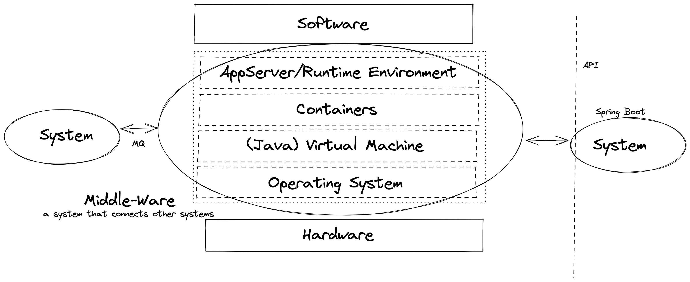

= Overview

:toc:

[cloud-intro]

== Module: Cloud Introduction (theory-block I)

* What is Cloud Computing? Encounters in everyday life and history
* Characteristic, advantages & challenges
* Terminology - public, private, hybrid, dedicated
* Abstraction layers - IaaS, PaaS, FaaS, SaaS
* Overview - Hypervisors, virtual machines, containers and orchestration
* Overview - Global cloud service providers (CSPs), technologies and corresponding offerings

=== Objectives and exercises
_The student is able to describe cloud computing in own words and list examples for offerings, topologies and technologies. Includes ability to differentiate between different abstraction layers and knowledge how those layers and according technologies interact with each other. No exercises in this module_

=== Links

 * https://landscape.cncf.io/
 * https://www.cncf.io/wp-content/uploads/2020/11/CNCF_Survey_Report_2020.pdf
 * https://csrc.nist.gov/publications/detail/sp/800-145/final

== Module: Container Intro

* What are containers and how do they work
* Containers vs. VMs 
* History of containers and rise of Docker
* Docker concepts: daemon, hub, dockerfile, CLI
* Running containers with various options

=== Objectives and exercises
_The student understands the concepts and use cases of container technology and is able to describe them. The first exercise is to pull sample images from an image registry (e.g. Docker Hub) and interact with them (run, expose port, execute shell, cleanup etc). After that the student can show how to build a custom image via Dockerfile and push it to a registry for others to access. Complete the exercises handed out via URL._

=== Review questions

* What is the difference between a container and a VM? List 3 criteria
* Which technologies led to the evolution of docker (and why)? VMs, namespaces, chroot, cgroups, LXC, CF/Google containers
* What is the difference between a docker daemon and the docker hub? Daemon = runtime, Docker Hub = public registry
* What is the difference between docker run, docker pull and docker start?
* Which command transitions from a container instance to an image?
* What does docker exec do?

=== Links

* https://labs.play-with-docker.com/
* https://katacoda.com/
* https://opencontainers.org/
* https://www.docker.com/products/docker-desktop
* https://www.youtube.com/watch?v=fqMOX6JJhGo

== Module: Spring Boot Introduction

* Background: Spring Framework - History & components
* Spring <- -> Spring Boot
* Spring Initializr (start.spring.io) & starter dependencies
* Basic project structure (folders, configuration ..)
* "Hello, World!" example explained
* Using Actuator

=== Objectives
_The student is able to build and configure an own Spring Boot application from scratch with the IDE of choice. The exercise is to build an own "Hello, World!" application that exposes various REST endpoints and is able to execute CRUD operations on the state of the application. Optional: Add logging and testing, configure Actuator._

=== Exercises

* Build a simple Spring Boot Microservice with the following starter dependencies: Web, Actuator
* Run the microservice and test the endpoint /actuator/health and /actuator/info
* Annotate the Microservice with @RestController and implement a "Hello, World!" method, which responds to an HTTP GET request.
* Add some basic "functionality" to make the service react to HTTP GET, POST calls (e.g. modify an internal list). Optional: PUT and DELETE
* Change the configuration to make the server run on port 8081 instead of 8080

=== Links

* https://spring.io/
* https://start.spring.io/
* https://spring.io/guides/
* https://www.baeldung.com/spring-boot/

* https://spring.io/tools
* https://www.jetbrains.com/idea/
* https://code.visualstudio.com/docs/java/java-tutorial
* https://marketplace.visualstudio.com/items?itemName=Pivotal.vscode-boot-dev-pack
* https://www.gitpod.io
