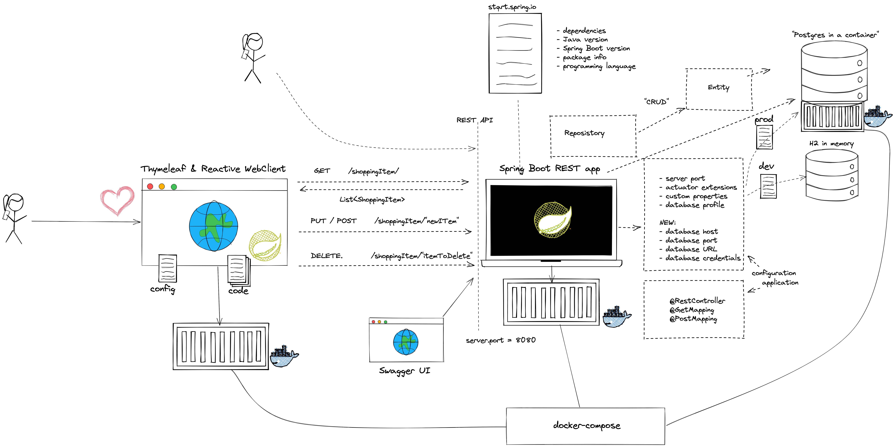

= Overview

=== Contact

* mail: maeddes (at) gmail.com (or HfT e-mail)
* twitter: @maeddes
* linkedin: https://www.linkedin.com/in/matthiashaeussler/

:toc:

[cloud-intro]

== Module: Cloud Introduction (theory-block I)

* What is Cloud Computing? Encounters in everyday life and history
* Characteristic, advantages & challenges
* Terminology - public, private, hybrid, dedicated
* Abstraction layers - IaaS, PaaS, FaaS, SaaS
* Overview - Hypervisors, virtual machines, containers and orchestration
* Overview - Global cloud service providers (CSPs), technologies and corresponding offerings

=== Objectives and exercises
_The student is able to describe cloud computing in own words and list examples for offerings, topologies and technologies. Includes ability to differentiate between different abstraction layers and knowledge how those layers and according technologies interact with each other. No exercises in this module_

=== Review questions

* "WHY" Cloud? Explain advantages (and disadvantages) IN YOUR OWN WORDS!
* Sketch a Cloud abstraction layer diagram and provide technology samples for each
* "aas" - Explain the term service as opposed to a product (in the context of cloud)

=== Links

 * https://landscape.cncf.io/
 * https://www.cncf.io/wp-content/uploads/2020/11/CNCF_Survey_Report_2020.pdf
 * https://csrc.nist.gov/publications/detail/sp/800-145/final

== Module: Container Intro

* What are containers and how do they work
* Containers vs. VMs 
* History of containers and rise of Docker
* Docker concepts: daemon, hub, dockerfile, CLI
* Running containers with various options

image::images/docker_diagram.png[Relation Container and Image]

=== Objectives and exercises
_The student understands the concepts and use cases of container technology and is able to describe them. The first exercise is to pull sample images from an image registry (e.g. Docker Hub) and interact with them (run, expose port, execute shell, cleanup etc). After that the student can show how to build a custom image via Dockerfile and push it to a registry for others to access. Complete the exercises handed out via URL._

=== Review questions

* "WHY" Containers? List advantages/disadvantages ..
* What is the difference between a container and a VM? List 3 criteria
* Which technologies led to the evolution of docker (and why)? VMs, namespaces, chroot, cgroups, LXC, CF/Google containers
* What is the difference between a docker daemon and the docker hub? Daemon = runtime, Docker Hub = public registry
* What is the difference between docker run, docker pull and docker start?
* Which command transitions from a container instance to an image?
* What are the Docker components and describe them?
* What does docker exec do? Provide a pseudo-code example and explain what it does 

image::images/container_exercises.png[Docker Exercises]

=== Open questions

* Does docker run also building images (prior to ruuning them)? "combination of docker create and start"

=== Links

* https://labs.play-with-docker.com/
* https://katacoda.com/
* https://opencontainers.org/
* https://www.docker.com/products/docker-desktop
* https://www.youtube.com/watch?v=fqMOX6JJhGo

== Module: Spring Boot Introduction

* Background: Spring Framework - History & components
* Spring <- -> Spring Boot
* Spring Initializr (start.spring.io) & starter dependencies
* Basic project structure (folders, configuration ..)
* "Hello, World!" example explained
* Using Actuator

image::images/spring_boot_intro.png[Spring Boot Intro]

=== Objectives
_The student is able to build and configure an own Spring Boot application from scratch with the IDE of choice. The exercise is to build an own "Hello, World!" application that exposes various REST endpoints and is able to execute CRUD operations on the state of the application. Optional: Add logging and testing, configure Actuator._

=== Exercises

* Build a simple Spring Boot Microservice with the following starter dependencies: Web, Actuator
* Run the microservice and test the endpoint /actuator/health and /actuator/info
* Annotate the Microservice with @RestController and implement a "Hello, World!" method, which responds to an HTTP GET request.
* Add some basic "functionality" to make the service react to HTTP GET, POST calls (e.g. modify an internal list). Optional: PUT and DELETE
* Change the configuration to make the server run on port 8081 instead of 8080

=== Review questions

* "WHY" Spring Boot? "WHY" Frameworks?
* What is the difference (and common aspects) between Spring and Spring Boot?
* What is the web page to start building your spring boot apps?
* What kind of things can you configure on that Initializr? 
* What is the role of the Actuator?

=== Links

* https://spring.io/
* https://start.spring.io/
* https://spring.io/guides/
* https://www.baeldung.com/spring-boot/

* https://spring.io/tools
* https://www.jetbrains.com/idea/
* https://code.visualstudio.com/docs/java/java-tutorial
* https://marketplace.visualstudio.com/items?itemName=Pivotal.vscode-boot-dev-pack
* https://www.gitpod.io

== Module: Container Images

* Difference and relation between container and container images
* Concepts of image layers
* "docker commit"
* History of Dockerfile. Initial, multi-stage & BuildKit
* Building container for Java apps
* Using Jib, Cloud-Native Buildpacks and Paketo

=== Objectives and exercises
_The student understands the relation between container image and container, how to instantiate a container from an image and how to commit to a new image from an existing container. The exercise is to build the previous Spring Boot application and put it into a container image using various options, e.g. different Dockerfile options, Google JIB, CND, Paketo and more ...? The student is aware and able to describe on a high-level what the different fundamentals of the various approaches are and is able to list advantages and disadvantages._

=== Review questions

* List 3 different options to build a container image
* Explain docker build vs docker commit 
* List 2 evolution steps of the Dockerfile and provide 1 improvement for each step (multi-stage, buildkit, caching)
* Explain or list 1 advantage&disadvantage comparing JIB and Paketo/CNB to original Dockerfiles
* How is a container image build up internally? Layers(!) -> effective storage of container binaries
* Which are criterias you can think that make image building "better" - less manual steps, less config, smaller size, faster build speed, effective structure

mvn compile com.google.cloud.tools:jib-maven-plugin:3.1.4:build -Dimage=<MY IMAGE>

=== Links

* https://docs.docker.com/engine/reference/builder/
* https://buildpacks.io/
* https://buildpacks.io/docs/tools/pack/
* https://paketo.io/
* https://github.com/maeddes/options-galore-container-build/blob/main/walkthrough.adoc
* https://github.com/GoogleContainerTools/jib

== Module: Persistence

* Recap of container
* Spring Data
* Concept of entities and repositories
* JPA and JDBC basics
* H2, PostgeSQL, MySQL - configuration via Spring Boot profiles
* Running databases as Docker images

=== Objectives and exercises
_The student is able to build a Spring Boot application (or extend an existing one) with Spring Data configuration. The exercise is to create an application, which performs CRUD operations on a database backend. The database can either be in-memory (H2) or a (containerized) PostgreSQL. The Optional: Provide a docker-compose file to stand up a multi-container environment with application and database._

=== Review Questions

* "WHY" persistence? "WHY" persistence frameworks like JPA?
* Describe the necessary components to build an application with Spring Data? Potentially sketch
* What does the annotation @Entity do? 
* How could docker compose help if you have a persistence-based application?

=== Links

* https://spring.io/projects/spring-data
* https://spring.io/guides/gs/accessing-data-jpa/
* https://www.baeldung.com/spring-data-derived-queries
* https://docs.spring.io/spring-boot/docs/1.0.x/reference/html/howto-database-initialization.html

== Module: Synchronous Communication, API & REST

* Synchronous communication
* REST 
  * HTTP, Basics, Maturity Model

=== Objectives and exercises
_The student understands the concepts of an API and synchronous communication in distributed systems and can explain it in own words._

=== Review questions

* Identify good and bad API examples and explain why
* Describe the concepts of Verbs and Nouns
* When is an invocation idempotent and safe? What does it mean? Provide examples
* Describe in your own words the mapping of REST calls to database (SQL) and CRUD calls

== Module: Cloud-native software development & Microservices (theory-block II)

* CAP Theorem
* Conway's Law
* Fallacies of distributed computing
* Domain-Driven Design basics
* 12-factor application
* Evolution of applications and deployments: Monolithic -> Service-Oriented Architecture -> Microservices
* Introduction to serverless and FaaS terminology

=== Objectives and exercises
_The student knows about the evolution of distributed systems (and middleware) and the drivers towards state-of-the-art implementation and deployment. She/he can explain the underlying concepts and theories and put it into practical context. No dedicated exercises for this module. Recap of basics: Spring Boot, Docker, configuration, persistence and messaging._

=== Review questions

* "WHY" Cloud-Native Software? What IS Cloud-Native Software?
* Why "evolution" from a monolithic approach to a distributed approach?
* How does the CAP Theorem/Conway's Law relate to this?
* (NO Domain-Driven Design questions)
* How do the 12-factor application "methodology" relate to the technologies that we covered in this semester? (important)

=== Links

* https://en.wikipedia.org/wiki/Fallacies_of_distributed_computing
* https://12factor.net/

== Module: External configuration deep-dive, OpenAPI Doc & Thymeleaf with reactive web client intro

* Various possibilities of external configuration in Spring (Boot)
* Order of configuration options
* Spring profiles
* Consuming configuration properties with @Value and specifying defaults

=== Objectives and exercises
_The student is able to build a Spring Boot application with various configuration profiles and knows how to set the desired one. It is also required to understand how Spring Boot will prioritize between them, e.g. ("Who wins if multiple are specified?") and what the advantages and drawbacks of them are. The exercise is to extend the existing persistence application and provide different persistence backend for different purposes, e.g. set an in-memory database for development and test purposes and a containerized one for production._

=== Review questions

* "WHY" is external configuration important in cloud-native software?
* Where did you see aspects of external configuration in the technologies we used? Provide examples

=== Links

* https://docs.spring.io/spring-boot/docs/1.2.3.RELEASE/reference/html/boot-features-external-config.html
* https://docs.spring.io/spring-boot/docs/1.3.0.M1/reference/html/howto-properties-and-configuration.html
* https://www.baeldung.com/spring-rest-openapi-documentation

=== Review questions

* "WHY" do you need an enterprise architecture? What are the requirements?
* How can you solve these problems with framework or containers?
* "At which do you need more?"
* "What else do you need?"

== 2021-12-10 Module: Kubernetes Intro

* Sketch: 
** Limitation of a stand-alone Docker environment
** Requirements/Responsibilities to provide an enterprise container runtime
* Presentation: Cloud Platforms & Kubernetes
** Kubernetes Background
** What is CaaS?
** Cluster & Node Concept
** Behaviour scenarios of Kubernetes in Action
** Base API objects: Deployments, ReplicaSets, Pods
** Intro into kubectl 
  
=== Objectives and exercises
_The student understands the requirements and expectations towards cloud platforms and is able to list them. She/he can explain the advantages over standard container operation with Docker. The exercise is to take a sample Spring Boot application and walk through the steps to containerize and deploy to Kubernetes. The student is aware about various options for local and remote Kubernetes options._

=== Links - Kubernetes Options

* https://github.com/learnk8s/free-kubernetes (Overview)

* https://www.katacoda.com/courses/kubernetes/playground (web-based)
* https://training.play-with-kubernetes.com/ (web-based, broken?)

* https://kind.sigs.k8s.io/docs/user/quick-start/ (local)
* https://minikube.sigs.k8s.io/docs/ (local)
* https://docs.docker.com/get-started/kube-deploy/ (local)
* https://k3s.io/ (local)
* https://microk8s.io/ (local)

* https://aws.amazon.com/de/education/awseducate/ (Student)
* https://azure.microsoft.com/en-us/free/students/ (Student)

